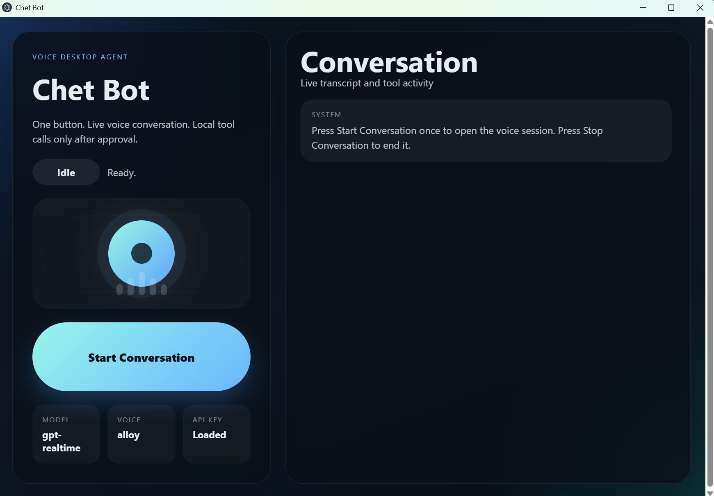

# Chet Bot

Voice-first desktop assistant for Windows using Electron and OpenAI Realtime.

## Screenshot

## Current behavior

- Press `Start Conversation` once to open a live session.
- Speak naturally; server VAD handles turns automatically.
- The assistant answers with voice and keeps the conversation going until you press `Stop Conversation`.
- Tool calls that can affect the machine require an explicit approval in the app UI.

## Requirements

- Node.js 22+ or newer
- An OpenAI API key with Realtime access
- Windows with microphone and speakers enabled

## Setup

1. Copy `.env.example` to `.env`.
2. Set `OPENAI_API_KEY`.
3. Run `npm install`.
4. Run `npm run dev`.

## Available tools

- `get_time`
- `take_screenshot`
- `list_windows`
- `focus_window`
- `mouse_click`
- `type_text`
- `read_file`
- `write_file`
- `open_url`
- `open_app`
- `run_powershell`
- `run_codex`
- `launch_chrome_debug`
- `chrome_new_tab`
- `chrome_close_tab`
- `chrome_list_tabs`
- `chrome_get_page`
- `chrome_inspect_elements`
- `chrome_navigate`
- `chrome_click`
- `chrome_type`
- `chrome_eval`
- `chrome_screenshot`
- `chrome_wait_for_selector`

## Safety

- File writes, window focus, typing, mouse clicks, browser launches, app launches, and PowerShell execution require approval.
- The current implementation is Windows-first and intentionally conservative.

## Build

- `npm run build`
- `npm run start`
